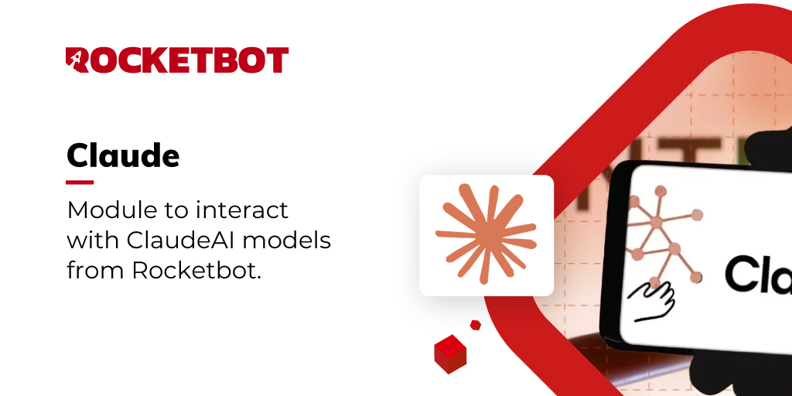

# ClaudeAI
  
Módulo para interagir com os modelos do ClaudeAI a partir do Rocketbot.  

*Read this in other languages: [English](Manual_ClaudeAI.md), [Português](Manual_ClaudeAI.pr.md), [Español](Manual_ClaudeAI.es.md)*
  

## Como instalar este módulo
  
Para instalar o módulo no Rocketbot Studio, pode ser feito de duas formas:
1. Manual: __Baixe__ o arquivo .zip e descompacte-o na pasta módulos. O nome da pasta deve ser o mesmo do módulo e dentro dela devem ter os seguintes arquivos e pastas: \__init__.py, package.json, docs, example e libs. Se você tiver o aplicativo aberto, atualize seu navegador para poder usar o novo módulo.
2. Automático: Ao entrar no Rocketbot Studio na margem direita você encontrará a seção **Addons**, selecione **Install Mods**, procure o módulo desejado e aperte instalar.  

## Como usar este módulo

Para usar este módulo, precisamos obter uma chave API do Claude AI e ter créditos disponíveis. Siga estes passos:

### Obtendo a Chave API

1. Primeiro, crie uma conta ou faça login em [console.anthropic.com](https://console.anthropic.com/settings/keys).

2. Uma vez na página de chaves API, clique no botão "Create Key" para criar uma nova chave.

3. Uma janela será aberta onde você precisará:
   - Selecionar o workspace onde a chave será usada (o padrão é "Default")
   - Inserir um nome descritivo para a chave
   - Clicar em "Add" para criar a chave

4. A chave API será exibida na tela. Use o botão de copiar para salvá-la.

**Importante**: Certifique-se de salvar a chave em um local seguro, pois você não poderá vê-la novamente depois de fechar esta janela.

### Comprando Créditos

Para usar a API do Claude, você precisa ter créditos disponíveis:

1. Visite a página de faturamento em 
[console.anthropic.com/settings/billing](https://console.anthropic.com/settings/billing)

2. Aqui você pode:
   - Ver seu saldo atual de créditos
   - Comprar mais créditos conforme necessário
   - Configurar pagamentos automáticos se desejar

**Nota**: Sem créditos disponíveis, você não poderá usar a API mesmo que tenha uma chave API válida.

### Usando o Módulo

Uma vez que você tenha sua chave API e créditos disponíveis, você pode usar o módulo da seguinte forma:

1. **Conectar ao Claude AI**:
   - Use o comando "Connect to Claude AI"
   - Insira sua chave API no campo correspondente
   - O módulo verificará a conexão e exibirá os modelos disponíveis

2. **Gerar Texto**:
   - Use o comando "Generate Text"
   - Insira seu prompt ou pergunta
   - Selecione o modelo a ser usado (por exemplo, claude-3-opus ou claude-3-sonnet)
   - Configure os parâmetros opcionais se desejar:
     - Temperature (0-1): controla a criatividade das respostas
     - Max Tokens: limite de tokens para a 
resposta
     - System Prompt: instruções ou contexto geral para o modelo
     - Stop Sequence: texto que irá parar a geração

3. **Consultar Modelos Disponíveis**:
   - Use o comando "Get Available Models"
   - Você verá uma lista dos modelos que pode usar com sua conta

### Recomendações

- Mantenha sua chave API segura e não a compartilhe
- Monitore seu uso de créditos regularmente
- Use o modelo mais apropriado para seu caso de uso:
  - claude-3-opus: maior capacidade e precisão
  - claude-3-sonnet: bom equilíbrio entre desempenho e custo
- Configure o system prompt para obter respostas mais consistentes
- Ajuste a temperatura com base na necessidade de respostas mais precisas (0) ou criativas (1)
## Descrição do comando

### Conectar com ClaudeAI
  
Estabelece conexão com ClaudeAI
|Parâmetros|Descrição|exemplo|
| --- | --- | --- |
|API Key|Sua chave de API do ClaudeAI|sk-ant...|
|Atribuir à variável|Nome da variável para armazenar a conexão|resultadoClaudeAI|

### Obter Modelos
  
Recupera os modelos disponíveis do ClaudeAI
|Parâmetros|Descrição|exemplo|
| --- | --- | --- |
|Atribuir à variável|Nome da variável para armazenar a lista de modelos|resultadoModelos|

### Gerar Texto
  
Gera texto usando o ClaudeAI
|Parâmetros|Descrição|exemplo|
| --- | --- | --- |
|Prompt|Texto de entrada para gerar texto|O que é Rocketbot?|
|Modelo|ID do modelo a ser usado|compound-beta-mini|
|Temperatura (opcional)|Controla a aleatoriedade da geração de texto (0.0 a 2)|0.8|
|Máximo de tokens (opcional)|Número máximo de tokens a serem gerados|100|
|Sequência de parada (opcional)|Sequência opcional para parar a geração de texto|ferramenta RPA|
|Atribuir à variável|Nome da variável para armazenar o texto gerado|resultadoTexto|
